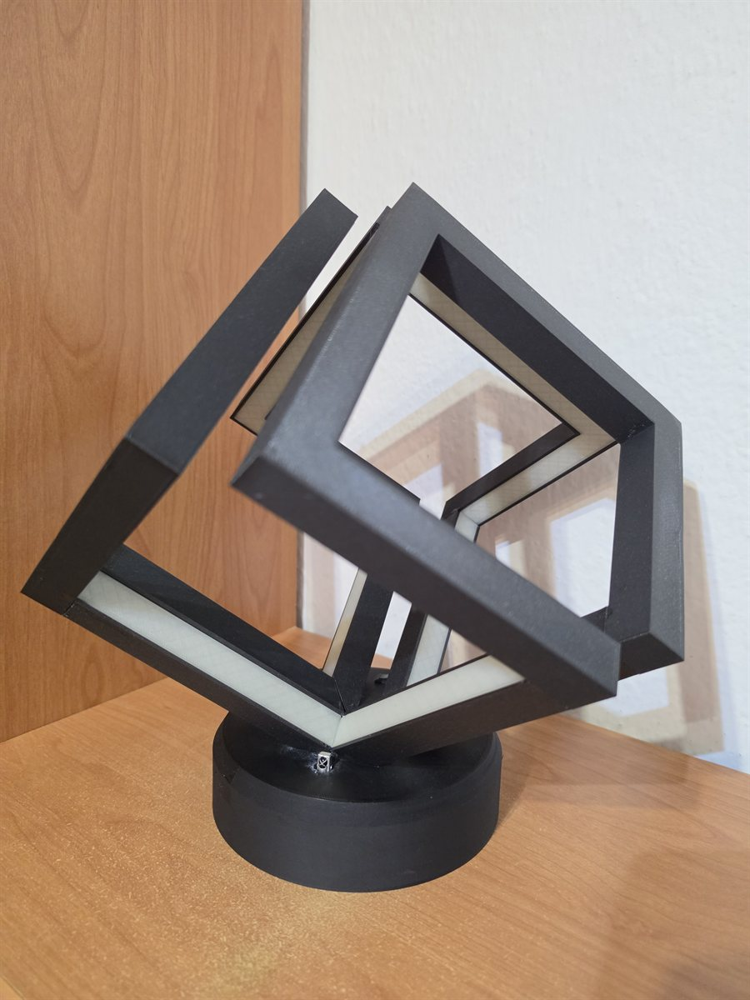
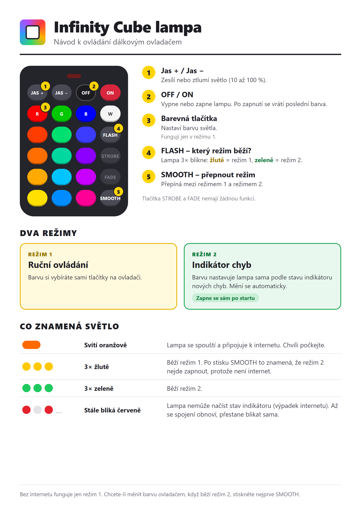

# infinity-cube-lamp

Firmware for a lamp with an RGB LED strip, running on an ESP8266 (NodeMCU v2). The strip is controlled with an infrared remote, and the firmware updates itself from GitHub Releases.



*The finished lamp (LEDs off).*

## Hardware

- ESP8266 NodeMCU v2
- RGB LED strip driven directly by three PWM pins (e.g. through MOSFETs)
- IR receiver
- Classic 24-button IR remote with colored buttons

Wiring (can be changed in [include/config.h](include/config.h)):

| Signal | GPIO |
|---|---|
| Red | 4 |
| Green | 12 |
| Blue | 5 |
| IR receiver | 14 (D5) |

## Controls

A printable A5 user manual in Czech is in [docs/manual-a5.png](docs/manual-a5.png). Its source is [docs/manual-a5.html](docs/manual-a5.html).

<a href="docs/manual-a5.png"></a>

| Button | Action |
|---|---|
| ON / OFF | turn the strip on / off (ON restores the last color) |
| VOLUME UP / DOWN | brightness in 10 % steps (10 to 100 %) |
| R, G, B, W | red, green, blue, white (mode 1 only) |
| other color buttons | shades by row, see `COLOR_BUTTONS` (mode 1 only) |
| SMOOTH | switch between mode 1 and mode 2 |
| FLASH | show the active mode: 3 yellow blinks = mode 1, 3 green blinks = mode 2 |

The STROBE and FADE buttons do nothing yet.

## Modes

- **Mode 1 (manual)** – the color is set with the remote.
- **Mode 2 (indicator)** – the lamp downloads `INDICATOR_URL` every 5 s and shows the color from the `rgb` field of the response, e.g. `{"color": "green", "rgb": [0, 255, 0]}`. ON/OFF and brightness still work.

After startup the lamp is in mode 2 if the URL answers, otherwise in mode 1. Without internet only mode 1 is available: pressing SMOOTH blinks yellow 3 times and the lamp stays in mode 1. If the download fails while in mode 2, the lamp blinks red until the next successful download. The manual color is kept while mode 2 is active.

## Configuration

Everything is in [include/config.h](include/config.h): pins, PWM frequency, brightness steps, default and boot color, the color table for the buttons, the indicator URL, poll interval and mode blink colors. Button codes are in [include/IRController.h](include/IRController.h).

## WiFi

Create `include/secrets.h` (it is in `.gitignore`):

```cpp
#define SECRET_SSID "wifi-name"
#define SECRET_PASS "wifi-password"
```

On the first upload over USB the credentials are saved to EEPROM. Firmware built by GitHub Actions has no `secrets.h` and uses the saved credentials. To change WiFi, edit `secrets.h` and upload the firmware over USB again.

## Build and upload

```
pio run -t upload
pio device monitor
```

On startup the strip glows orange while the device connects to WiFi and checks for updates, then switches to the default color. The firmware also prints its version and the result of the update check to the serial monitor.

## Source layout

- `src/main.cpp` – `setup()` and `loop()` only
- `src/Led.cpp` – PWM output, brightness, color, boot color
- `src/IrRemote.cpp` – IR receiver and button handling
- `src/Mode.cpp` – switching between mode 1 and mode 2, FLASH blinks
- `src/Indicator.cpp` – downloads the indicator URL and parses the color

## Firmware update (OTA)

Uses the [esp-ota-updater](https://github.com/davidvancl/esp-ota-updater) library. On startup the device checks the latest release and updates itself if a newer version exists.

Releasing a new version:
1. Increase `custom_version` in `platformio.ini`.
2. Commit and push to `main`.
3. GitHub Actions publish a release. The device updates after its next restart.

Do not push a locally changed version in `platformio.ini` unless you want to publish a release.
